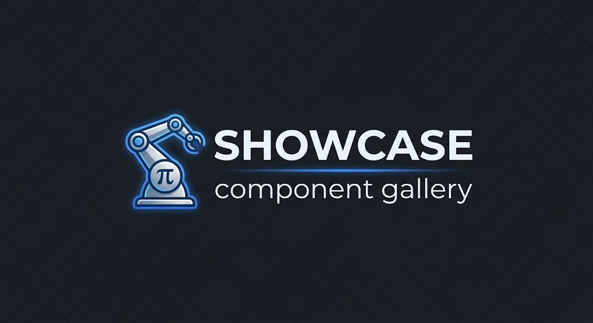

# showcase

<p align="center">
  
</p>

A lightweight, Storybook-like component gallery. Register a set of showcase
"files" — each with a `name` and several named variant components — and get a
sidebar + canvas UI with URL deep-linking (`?file=..&showcase=..`).

> Built and maintained by [auto-pi](https://github.com/AntonLapshin/auto-pi) — an
> autonomous engineering team harness for Pi.

## Live demo

Live GitHub Pages demo: **[https://AntonLapshin.github.io/showcase/](https://AntonLapshin.github.io/showcase/)**

Open any showcase, and its selection is reflected in the URL — you can share a
deep link, refresh, and use back/forward to navigate selections.

## Stack

- [Vite](https://vitejs.dev/) + [React](https://react.dev/) + [TypeScript](https://www.typescriptlang.org/)
- [Vitest](https://vitest.dev/) for unit tests, with 100% coverage enforced on `src/core/**/*.ts`

> **Style-framework agnostic.** The library ships with plain CSS only (no
> Tailwind or other framework dependency at build time or runtime) — you can
> drop it into any existing project and style it however you like.

## Getting started

```bash
npm install          # install dependencies
npm run dev          # start the dev server (localhost:5173)
npm run build        # type-check (`tsc`) then build the demo for production
npm run preview      # preview the production build locally
```

## Scripts

| Script                  | Purpose                                          |
|-------------------------|--------------------------------------------------|
| `npm run dev`           | Start the Vite dev server                        |
| `npm run build`         | Type-check then build the demo for production    |
| `npm run build:lib`     | Build the reusable library bundle + types (`dist/`) |
| `npm run preview`       | Preview the production build locally             |
| `npm run lint`          | Run ESLint (max-warnings 0)                      |
| `npm test`              | Run unit tests (Vitest)                          |
| `npm run test:coverage` | Run tests and enforce 100% core coverage         |

## Using it as a library

The package builds a reusable ESM bundle (`dist/showcase.js`) plus TypeScript
declarations via `npm run build:lib` (or automatically on `npm pack` /
`prepublishOnly`). `react` and `react-dom` are **peer** dependencies — the
consumer provides its own React.

```tsx
import { Showcase } from "showcase";

function App() {
  return <Showcase />;
}
```

Or use just the pure core engine (no React runtime) to drive your own UI:

```ts
import {
  createShowcaseRegistry,
  createShowcaseState,
  select,
  encodeUrlPath,
  decodeUrlPath,
} from "showcase";

const registry = createShowcaseRegistry(myFiles);
const state = select(createShowcaseState(), registry, "Button", "Primary");
console.log(encodeUrlPath(state.selection)); // ?file=Button&showcase=Primary
```

## How to add a showcase file

1. Create a file under `src/ui/showcases/` (e.g. `src/ui/showcases/Chip.tsx`),
   exporting a `name` constant and one component per variant:

   ```tsx
   export const name = "Chip";

   export const Primary = () => (
     <span className="sample-chip sample-chip--primary">
       Primary
     </span>
   );

   export const Outline = () => (
     <span className="sample-chip sample-chip--outline">
       Outline
     </span>
   );
   ```

   Plain-CSS styling lives in scoped stylesheets under `src/styles/` (see the
   sample styles in `src/styles/showcases.css`).

2. Register it in `src/ui/showcases/index.ts` by importing the module and adding
   a `ShowcaseFile` entry whose `name` matches the exported `name` constant:

   ```tsx
   import * as Chip from "./Chip";

   export const demoShowcaseFiles: readonly ShowcaseFile[] = [
     // ...existing files...
     {
       name: Chip.name,
       showcases: {
         Primary: Chip.Primary,
         Outline: Chip.Outline,
       },
     },
   ];
   ```

3. That's it — the sidebar, canvas, and URL deep-linking pick it up
   automatically. Variants are pure presentational components: keep business
   logic in `src/core`.

## Architecture

The project enforces a strict **core / UI split** (plan.md §19.1):

- `src/core/**` — pure business logic, no React, no DOM. **100% test coverage is
  required here.** The showcase engine (`src/core/showcase.ts`) owns the data
  model, registry validation, and selection / expand-collapse / URL
  (de)serialization state transitions.
- `src/ui/**` — thin, dumb view layer. `Showcase.tsx` is a presentational
  component; `useShowcase.ts` is a thin view model that binds core functions to
  component state and syncs the URL via `window.history` / `popstate`
  (router-agnostic — no react-router dependency).

## Project documents

- [`manifest.md`](manifest.md) — project charter / intent
- [`project-state.md`](project-state.md) — current state and progress
- [`CHANGELOG.md`](CHANGELOG.md) — versioned change log
- [`plans/slice-01.md`](plans/slice-01.md) — the current implementation slice
